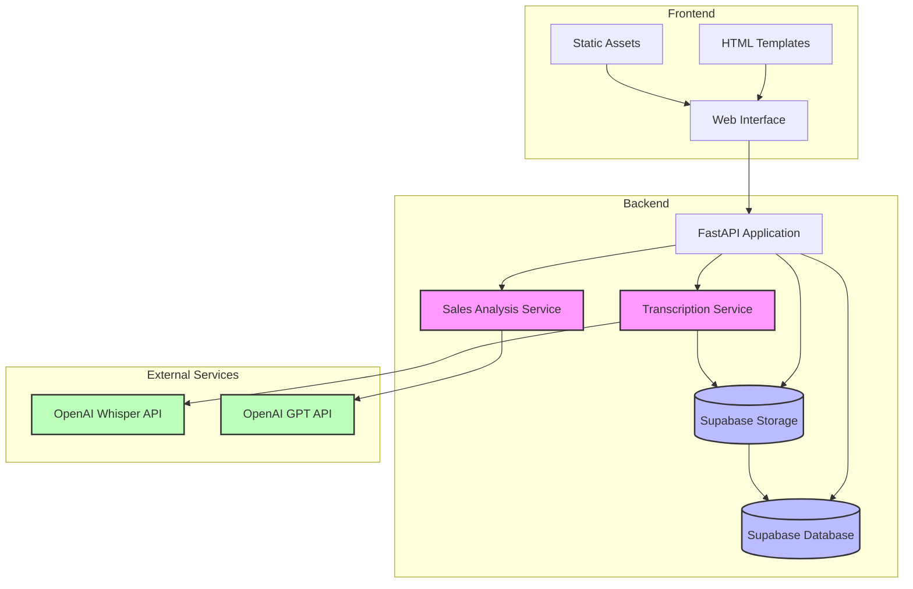
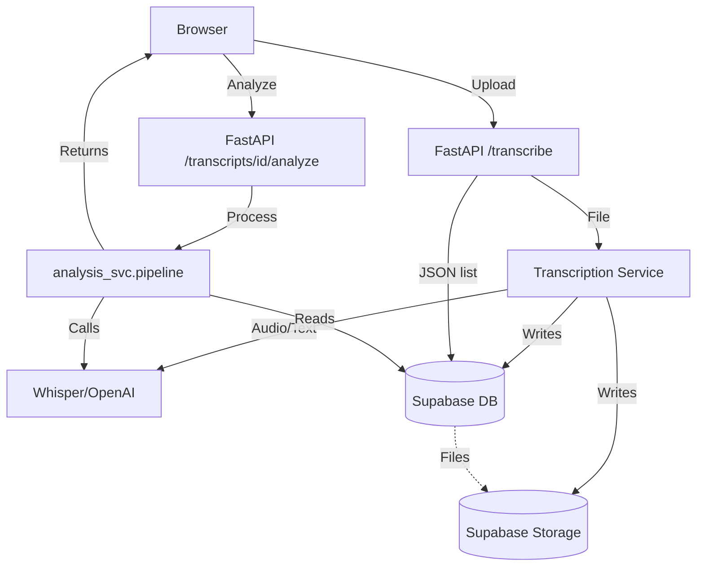

# Whisper Transcription App

A FastAPI application that transcribes audio and video files using OpenAI's Whisper API and stores the transcriptions in Supabase.

## Requirements

- Docker CLI
- Docker Compose or docker-compose plugin
- Either Docker Desktop or Colima (recommended for macOS users)
- OpenAI API key
- Supabase account and project

## Features

### Transcription

- Upload audio and video files for transcription
- Supports multiple file formats (MP3, WAV, MP4, etc.)
- Stores transcripts in a Supabase database
- View and manage all transcriptions

### Sales Intelligence Analysis

The application includes an AI-powered sales intelligence feature that can analyze meeting transcripts to extract:

- Client company name
- Stakeholder names and roles
- Pain points mentioned by clients
- Sales opportunities
- Research triggers for follow-up
- Contextual information for personalization

To use the feature:
1. View a transcript
2. Click the "Analyze Sales Intelligence" button
3. The AI will process the transcript and display structured insights

This feature helps sales teams quickly extract actionable intelligence from sales calls and meetings.

## Architecture

### System Overview

The application follows a modular, microservices-inspired architecture with clear separation of concerns. It's built using FastAPI for the backend, with a modern single-page frontend, and leverages several key services for its core functionality.

### Component Architecture



### Core Components

1. **Frontend Layer**
   - Single-page web interface built with HTML, CSS, and JavaScript
   - Responsive design for desktop and mobile use
   - Real-time feedback for file uploads and processing
   - Interactive transcript viewer with analysis capabilities

2. **API Layer (FastAPI)**
   - RESTful API endpoints for all operations
   - File upload handling with validation
   - Authentication and authorization (via Supabase)
   - WebSocket support for real-time updates
   - Request validation using Pydantic models

3. **Transcription Service**
   - Handles audio/video file processing
   - Integrates with OpenAI's Whisper API
   - Supports multiple file formats
   - Manages temporary file storage
   - Handles language detection and transcription

4. **Sales Analysis Service**
   - LLM-powered analysis pipeline
   - Extracts structured data from transcripts
   - Identifies key sales intelligence points
   - Generates actionable insights
   - Uses GPT-4 for advanced analysis

5. **Data Layer**
   - Supabase PostgreSQL database for transcript storage
   - Supabase Storage for media file management
   - Efficient indexing for quick transcript retrieval
   - Secure file access control

### Data Flow

1. **File Upload Process**
   ```
   Client -> FastAPI -> Local Storage -> Whisper API -> Supabase Storage -> Database
   ```

2. **Transcription Analysis**
   ```
   Database -> Analysis Service -> GPT API -> Structured Data -> Client
   ```

### Security Architecture

- Environment-based configuration
- Secure API key management
- File type validation
- Size limits and rate limiting
- Supabase authentication integration
- Secure file storage with access controls

### Scalability Considerations

- Containerized deployment for easy scaling
- Stateless API design
- Efficient file handling
- Database indexing for performance
- Caching strategies for frequently accessed data

### Development Workflow

- Docker-based development environment
- Hot-reloading for frontend changes
- Comprehensive logging
- Error tracking and monitoring
- CI/CD ready structure

> The choice of each library balances productivity (FastAPI, Pydantic), scalability (async/await, Uvicorn), portability (Supabase), and observability (detailed tracebacks) – resulting in an elegant, modular, and production-ready stack.

## Setup

### 1. Clone the repository

```bash
git clone https://github.com/yourusername/whisper-transcription.git
cd whisper-transcription
```

### 2. Configure environment variables

Create a `.env` file in the project root:

```
# OpenAI API Configuration
OPENAI_API_KEY=your_openai_api_key
OPENAI_MODEL=gpt-4o-mini  # Optional, defaults to gpt-4o-mini

# Supabase Configuration
SUPABASE_URL=https://your-project.supabase.co
SUPABASE_ANON_KEY=your_supabase_anon_key
SUPABASE_SERVICE_ROLE_KEY=your_supabase_service_role_key
SUPABASE_STORAGE_BUCKET=transcripts
```

### 3. Set up Supabase

1. Create a new project in Supabase
2. Create a storage bucket named "transcripts"
3. Create a table named "transcripts" with the following schema:

```sql
create table if not exists public.transcripts (
  id               uuid primary key default gen_random_uuid(),
  transcript       text       not null,
  storage_path     text       not null,
  duration_seconds integer    not null,
  language         text       default 'en',
  created_at       timestamptz default now()
);
```

### 4. Docker Environment Setup (for macOS users)

You can use either Docker Desktop or Colima:

#### Using Colima (Recommended for macOS)

Install Colima if you haven't already:

```bash
# Install Colima and Docker CLI
brew install colima docker docker-compose

# Start Colima with recommended settings
colima start --cpu 4 --memory 8 --disk 60 --mount-type virtiofs
```

The start.sh script will automatically detect and use Colima if installed.

## Running the Application

```bash
# Start the application
./start.sh
```

The application will be available at http://localhost:8081

```bash
# View logs
docker compose logs -f
# or
docker-compose logs -f

# Stop the application
docker compose down
# or
docker-compose down
```

## Application Flow (app.py)


